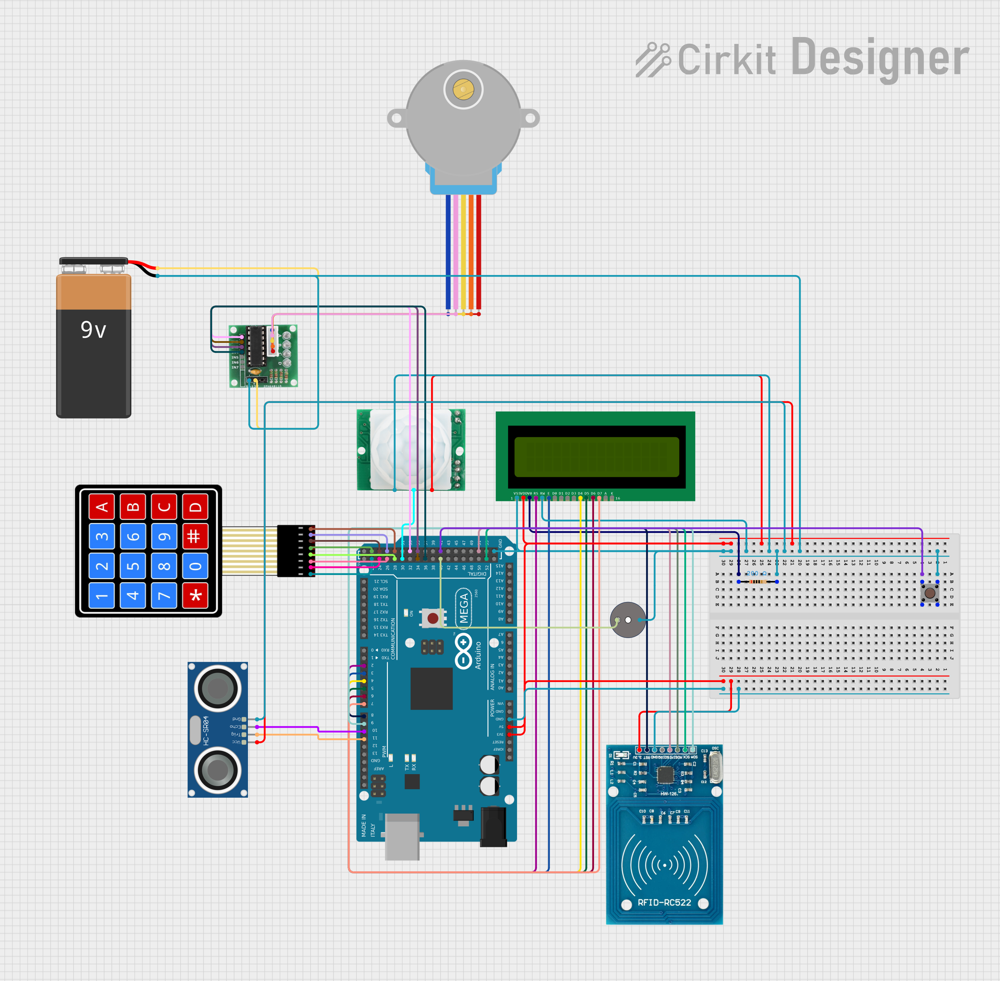
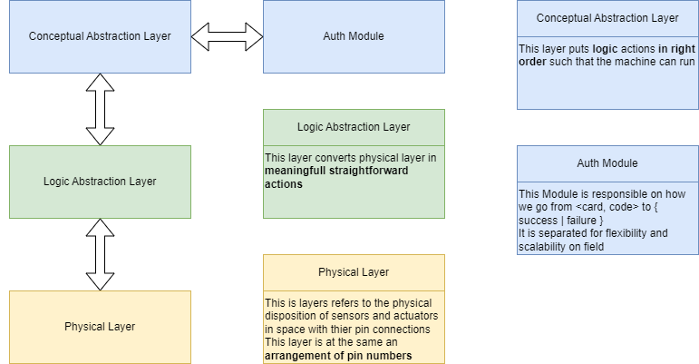
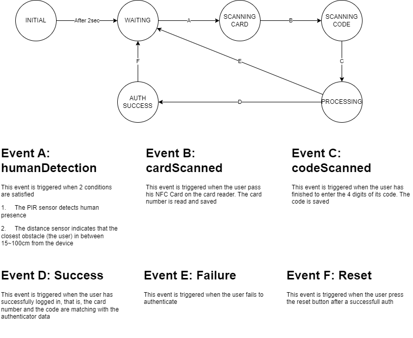

# Arduino 2FA

**An IoT device that proctect and monitor access to your rooms and assets**

## Table of Contents

- [Overview](#overview)
- [Important Notice](#important)
- [Problem Solved](#problem-solved)
- [Solution](#solution)
- [How It Works](#how-it-works)
- [Circuit Analysis](#circuit-analysis)
  - [Circuit Diagram](#circuit-diagram)
  - [Sensors](#sensors)
  - [Actuators](#actuators)
- [Layered Analysis](#layered-analysis)
  - [Physical Layer](#physical)
  - [Logic Layer](#logic)
  - [Conceptual Layer](#conceptual)
- [State Analysis](#state-analysis)
- [Limitations](#limitations)
- [License](#license)
- [Author](#author)

## Overview

Arduino 2FA is an IoT Device based on Arduino Mega that implements 2 Factor Authentication with an RFID Card as first factor and a secret code as second factor. The goal of the device is to protect a physical asset (e.g a Server Room) from unauthorized access and to monitor how people access it.

## Important

I did this project as an IoT Hobbyist. Although i have an IT Backgroud,  **i am not Electronics Engineer!** The methods and rules used to build this project were inspired from my arduino experience and notes from Software Engineering courses i took at university and not from a formal Electronics Engineering Background.

## Problem Solved

Unsupervised access on physical assets that are supposed to be private.

## Solution

A device that brings 2 layers of authentication
- **Something you owes**: an RFID Card
- **Something you know**: a Secret Code

## How It Works

1. When the device is powered on, It displays a welcome message a after a couple of seconds, the device really starts.
2. When someone gets close to the device (< 25 cm), the device beeps : the process has started
3. The user places the RFID Card on the reader, if the device beeps it means that the card has been read and the process continues
4. The user inputs a 4 digits secret code on the 4X4 Keyboard
5. The device sends the informmation to an authentication authority the will repond with true (or 1) on success and false (or 0) o failure
6. On success, the device twice once and unlocks the system : a Stepper Motor connected to a classic lock system will unlock it
7. To lock the system back, the user will simply press a reset button: the systemwill lock back and return it waiting state
8. If the authentication fails, the device beeps once and return to waiting state

## Circuit Analysis

### Circuit Diagram

### Sensors

- PIR Sensor: detect human presence near the device
- Ultrasonic Sensor: detect when someone or something stands infront of the device
- ​RC522–RFID Module​: reads the card
- Keypad: reads the code as it is typed
- Reset Button

### Actuators

- Stepper Motor: locks and unlock the system
- LCD Screen: visual feedback and instructions
- Buzzer: audio feedback

## Layered Analysis

I was inspired by the 3 layers of MÉRISE to analyse the requirements and come out with the machine's image

### Physical

At this layer the device is :
1. A network of IoT modules connected to the Microcontroller Board
2. An arrangement of pin numbers

### Logic

Built on top of physical layer. We have mooved from pin numbers to **meaningfull and straihtforward actions**

### Conceptual

That's where the device comes to life. The conceptual layer is where the machine is designed to adopt the actual behavior we want. The next section will explain it further.

## State Analysis

The State diagram above is the most important concept you have to know about the device. The device is a **state machine**.
That state diagram could be extended to add more features.

## Limitations

In the actual state of the device, it is not connected to a real Authentication Authority, and therefore it does not yet implement monitoring.

## License

GPL

## Author

JustSympa